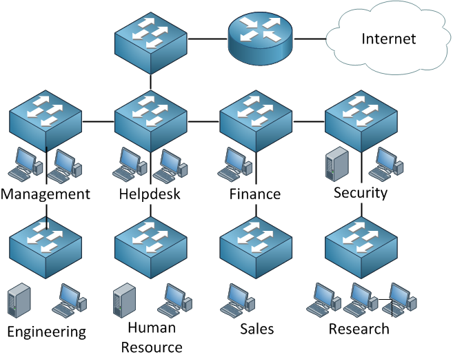

# VLANs and Trunk

## Introduction to VLANs

First of all let me show you a picture of a network:

<figure><figcaption></figcaption></figure>

Look at this picture for a minute, we have many departments and every department has its own switch. Users are grouped physically together and are connected to their switches. what do you think of it? Does this look like a good network design? If you are unsure, let me ask you some questions to think about:

* What happens when a computer connected to the Research switch sends a broadcast like an ARP request?
* What happens when the Helpdesk switch fails?
* Will our users at the Human Resource switch have fast network connectivity?
* How can we implement security in this network?

Now let me explain to you why this is a bad network design. If any of our computers send a broadcast, what will our switches do? They flood it! This means that a single broadcast frame will be flooded on this entire network. This also happens when a switch hasn’t learned about a certain MAC address. The frame will be flooded.

If our helpdesk switch would fail this means that users from Human Resource are “isolated” from the rest and unable to access other departments or the internet, this applies to other switches as well. Everyone has to go through the Helpdesk switch in order to reach the Internet which means we are sharing bandwidth, probably not a very good idea performance-wise.

Last but not least, what about security? We could implement [port security](https://networklessons.com/switching/how-to-configure-port-security-on-cisco-switch) and filter on MAC addresses, but that’s not a very secure method since MAC addresses are very easy to spoof. VLANs are one way to solve our problems.

One more question I’d like to ask you to refresh your knowledge:

* How many broadcast domains do we have here?

What about broadcast domains? We didn’t talk about this before, but I think you can answer it. If a computer from the sales switch would send a broadcast frame, we know that all other switches will forward it. Did you spot the router on top of the picture? What about it…do you think a router will forward a broadcast frame?

The answer is that routers don’t forward broadcast frames so they effectively “limit” our broadcast domain. Of course, on the right side of our router, where we have an Internet connection this would be another broadcast domain…so we have two broadcast domains here. Let’s see how we can improve things…

<figure><figcaption></figcaption></figure>

When you work with switches, you must remember that there’s a big difference between physical and logical topology. Physical is just the way our cables are connected, while logical is how we have set up things ‘virtually’. In the example above, we have four switches, and I have created 3 VLANs called Research, Engineering, and Sales. A VLAN is a Virtual LAN, so it’s like having a “switch inside a switch”.

What are the advantages of using VLANs?

* A VLAN is a single broadcast domain, meaning that if a user in the research VLAN would send a broadcast frame, only users in the same VLAN will receive it.
* Users can only communicate within the same VLAN unless you use a router.
* Users don’t have to be grouped physically together. As you can see, we have users in the Engineering VLAN sitting on the 1st, 2nd, and 3rd floors.

That’s all for now. I hope this has given you an idea of what VLANs are and why we use them! If you enjoyed this lesson, please leave a comment.

\
